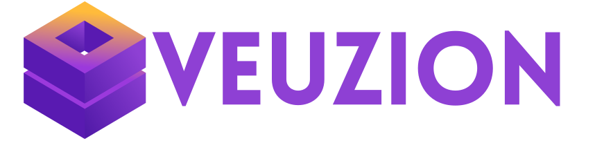
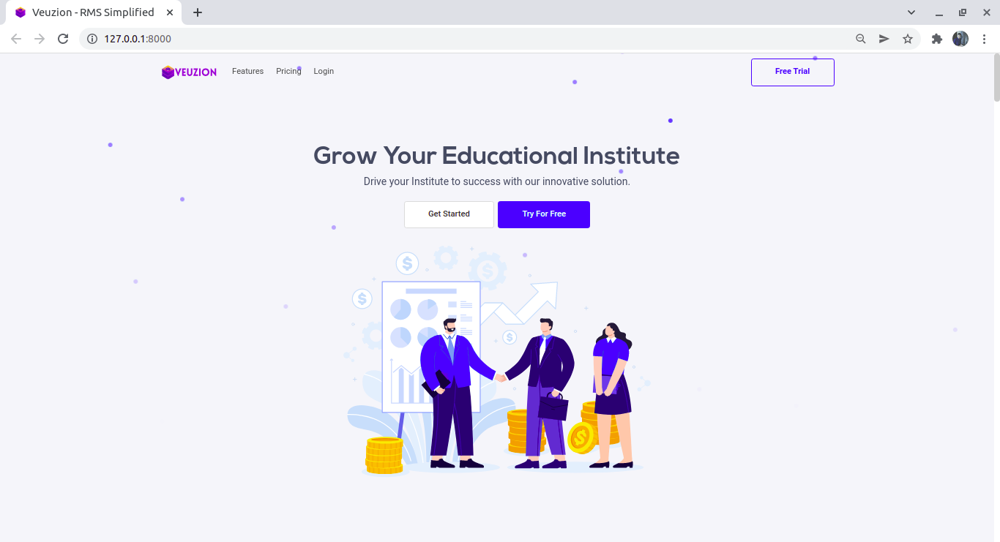
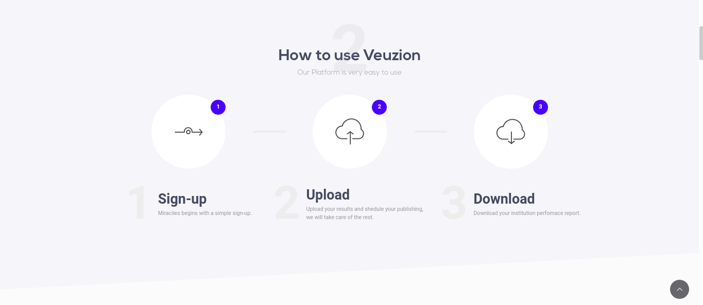
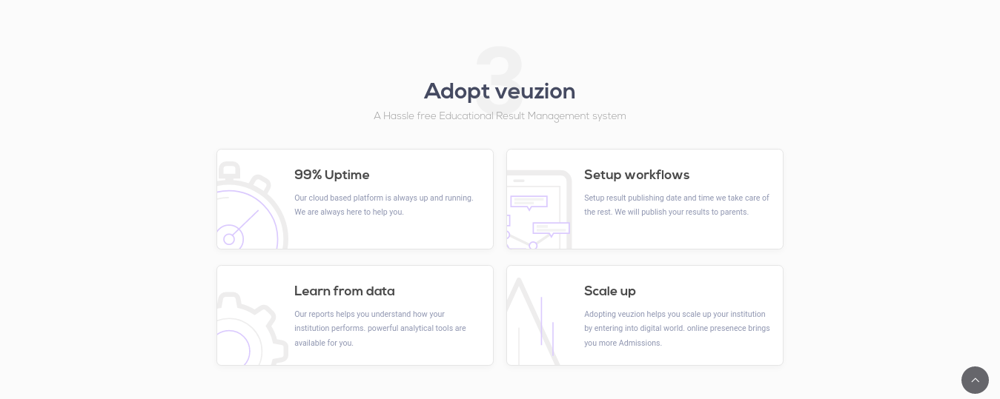
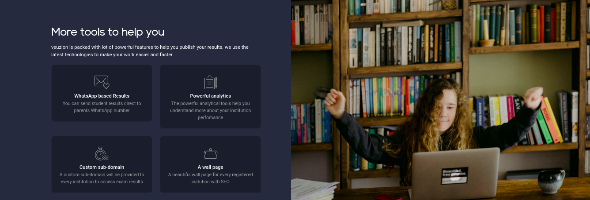
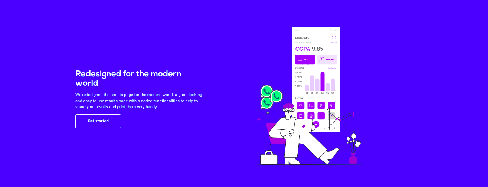

<!-- PROJECT LOGO -->
<br />
<div align="center">
  <a src="/logo/veuzion-logo.svg">
    
  </a>

  <h3 align="center">Project Veuzion</h3>

  <p align="center">
    RMS symplified, buiding with love for inidan institutions!
    <br />
    <a href="https://github.com/ioeshu/veuzion"><strong>Explore the docs »</strong></a>
    <br />
    <br />
    <a href="https://veuzion.com">View Demo</a>
    ·
    <a href="https://github.com/ioeshu/veuzion/issues">Report Bug</a>
    ·
    <a href="https://github.com/ioeshu/veuzion/issues">Request Feature</a>
  </p>
</div>


<!-- TABLE OF CONTENTS -->
<details>
  <summary>Table of Contents</summary>
  <ol>
    <li>
      <a href="#about-the-project">About The Project</a>
      <ul>
        <li><a href="#built-with">Built With</a></li>
      </ul>
    </li>
    <li>
      <a href="#getting-started">Getting Started</a>
      <ul>
        <li><a href="#prerequisites">Prerequisites</a></li>
        <li><a href="#installation">Installation</a></li>
      </ul>
    </li>
    <li><a href="#usage">Usage</a></li>
    <li><a href="#roadmap">Roadmap</a></li>
    <li><a href="#contributing">Contributing</a></li>
    <li><a href="#license">License</a></li>
    <li><a href="#contact">Contact</a></li>
    <li><a href="#acknowledgments">Acknowledgments</a></li>
  </ol>
</details>


<!-- ABOUT THE PROJECT -->
## About The Project



Veuzion is a SaaS product that allows schools, colleges, universities to utilize the power of the new technologies to easily organize their institute results for free of cost.

There are many RMS - Result managament systems out there but they comes with a cost. only few schools, collages and universites can afford these products. 

A version of veuzion part is always free for these educational institutes.

Here's why:
* More than 460 thousand private schools and 36k+ colleges didn’t have the platform to post their results.

* Institutes have the RMS system but they are not well managed which makes the frequent cause of the server outage, and they are costly.

* As of 2018 in India, the number of government schools in India was
over a million while the privately managed schools were 460
thousand. 
* The Indian schooling system is one of the largest in the
world and caters to over 250 million students. 944 universities, 36,308 colleges and 9,090 stand-alone institutions


`Downlaod Veuzion` to contribute to indian education institutes

<p align="right">(<a href="#top">back to top</a>)</p>


### Built With

Here are the list of major frameworks/libraries used to build veuzion. 

* [Django](https://www.djangoproject.com/)
* [React.js](https://reactjs.org/)
* [Vue.js](https://vuejs.org/)
* [Bootstrap](https://getbootstrap.com)
* [JQuery](https://jquery.com)

<p align="right">(<a href="#top">back to top</a>)</p>


<!-- GETTING STARTED -->
## Getting Started

Veuzion project build on Django framework , Django is a Python-based free and open-source web framework that follows the model–template–views architectural pattern. It is maintained by the Django Software Foundation, an independent organization established in the US as a 501 non-profit.

### Prerequisites

You need to have Python and git installed on your system wheather is a mac/windows/linux 


### Installation


1. Downlaod git and python to your system
2. Clone the repo
   ```sh
   git clone https://github.com/ioeshu/veuzion.git
   ```
3. create and start a a virtual environment
   ```sh
    virtualenv env --no-site-packages
    source env/bin/activate
   ```
4. Install the project dependencies:
   ```sh
   pip install -r requirements.txt
   ```
5. Run the project
   ```sh
   python manage.py runserver
   ```


<p align="right">(<a href="#top">back to top</a>)</p>


<!-- USAGE EXAMPLES -->
## Usage


_For more details, please refer to the [Documentation](https://veuzion.com/docs)_


<!-- CONTRIBUTING -->
## Contributing

Contributions are what make the open source community such an amazing place to learn, inspire, and create. Any contributions you make are **greatly appreciated**.

If you have a suggestion that would make this better, please fork the repo and create a pull request. You can also simply open an issue with the tag "enhancement".
Don't forget to give the project a star! Thanks again!

1. Fork the Project
2. Create your Feature Branch (`git checkout -b feature/AmazingFeature`)
3. Commit your Changes (`git commit -m 'Add some AmazingFeature'`)
4. Push to the Branch (`git push origin feature/AmazingFeature`)
5. Open a Pull Request

<p align="right">(<a href="#top">back to top</a>)</p>


<!-- LICENSE -->
## License

Distributed under the MIT License. See `LICENSE.txt` for more information.

<p align="right">(<a href="#top">back to top</a>)</p>


<!-- CONTACT -->
## Contact

Eswar- [@ioeshu](https://twitter.com/ioeshu) - a.eswar954@gmail.com

Project Link: [https://github.com/ioeshu/veuzion](https://github.com/ioeshu/veuzion)

<p align="right">(<a href="#top">back to top</a>)</p>


## Project Screenshots








##Note

### This project has been moved to ptrivate repo interested one drop a mail:  Eswar - [@ioeshu](https://twitter.com/ioeshu) - a.eswar954@gmail.com

<!-- ACKNOWLEDGMENTS -->
## Acknowledgments

your contribution will be shout out here in the Acknowledgements section.

* [YOUR NAME HERE]()


<p align="right">(<a href="#top">back to top</a>)</p>
